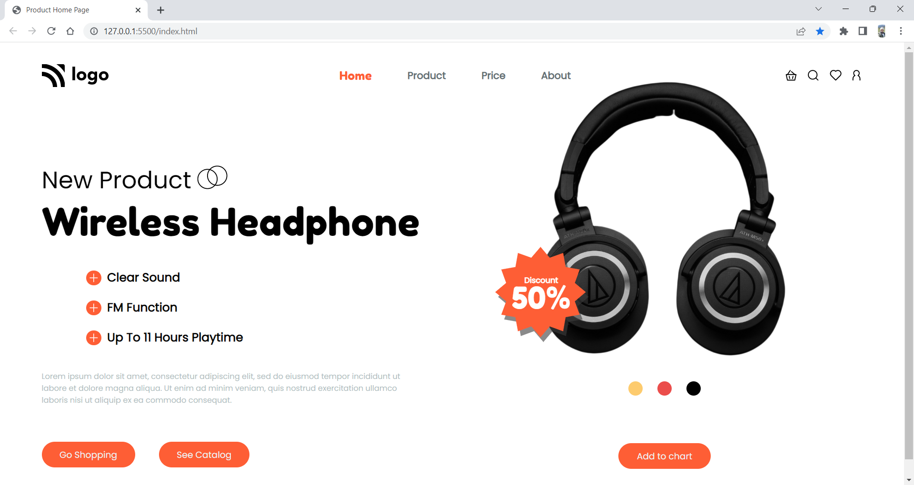

# Project 7: Product Home Page

   

### Name:

> `Anshul Ghogre`

## Key Learnings from the project

- _For the first time,learned about mobile responsiveness and learned to use media quires with breakpoints._
- _Explored shadow properties._

---

### Screenshots:-

---

> Time taken to complete this project: 9hrs

---

## [Live-Link](https://project-7-product-home-page.netlify.app/)

---
